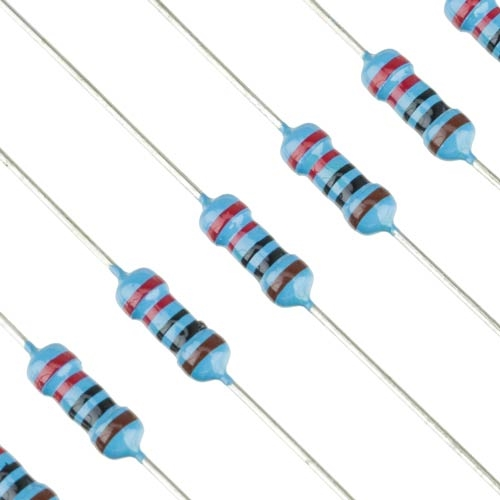
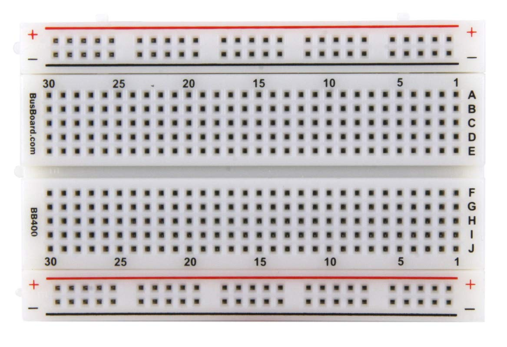
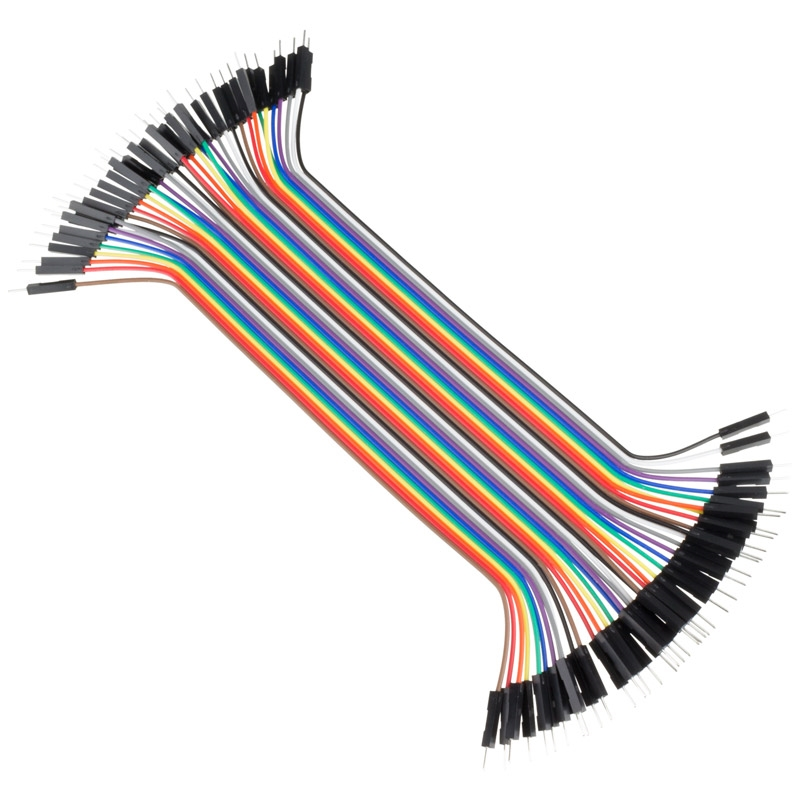

# p2ndaw.githuob.io
  
## Intro:

My name is Pape Ndaw and I'm going into my sophomore year at Swampscott High School in Massachusetts. This summer I built a security system utilizing an ultrasonic sensor, a keypad, and a RFID card reader. In this reposotory I'll be showing you exactly how it works.

## How It Works:

The ultrasonic sensor detects how close something is to the system. Once something is close the light will turn off signaling that it is detecting something. From there you will enter a single digit code to continue. If the code is correct you scan your card on the RFID reader and in the card is right you will have access.
   
## Picture:

I will have a full skematic linked below, but I will go through and explain it to you step by step.


                            
 ## 1- Ultrasonic Sensor:

The first thing I did was connect my ultrasonic sensor to my motherboard, the Elegoo Mega 2960 R3. My sensor has 4 pins the VCC, TRIG, ECHO, and GND. The VCC is the pin that is connected to power so I had it connected to 3.3v pin on the Mega. After that I connected the grounf. Without the ground the eletricity flowing will be too much and could end in potential injury. Next we have the Trig and Echo pins. In order to sense what an ultrasonic sensor does is send out a frequency until it hits an object. That is the trig pin. The echo pin receives the frequency when its coming back from hitting an object. I plug those into their respective pins and move on to the next step.

Here is the code for the sensor on it's own.

```C++
#include "SR04.h"
#define TRIG_PIN 3
#define ECHO_PIN 2
SR04 sr04 = SR04(ECHO_PIN, TRIG_PIN);
long distance;

void setup() {
  Serial.begin(9600);
  /* Enable the SPI interface */
  SPI.begin();
}

  void loop() {
  distance = sr04.Distance();
  // We start with if distance is < 100
  if (distance < 100) {
    digitalWrite(BLUE, LOW);
    // Serial.println("pls scan now");
  }
  }
```


## 2- RFID and Keypad       

Next, I connected my RFID(radio frequency identification system), which uses radio waves, to scan my card. For this you need to make sure that your wiring is precise and that you accurately define your pins in your code. Also keep in mind that your RFID needs to be plugged into a ground at all times or else it will not turn on. Once your RFID is correctly plugged in and set, you can now move on to connecting your keypad. As long all the pins are digital pins, it doesn't really matter where plug in the keypad but my own personal preference is using pins 23-51 odd.

Below I'll attach both the sckmatics and code for both the keypad and the RFID.
RFID Code:
```C++
/* Include the RFID library */
#include <RFID.h>
#define SDA_DIO 53
#define RESET_DIO 2
RFID RC522(SDA_DIO, RESET_DIO);

void setup() {
  Serial.begin(9600);
  /* Enable the SPI interface */
  SPI.begin();
  /* Initialise the RFID reader */
  RC522.init();
}

void loop() {
   if (RC522.isCard()) {
      /* If so then get its serial number */
      String cardNumberScanned = "";
      RC522.readCardSerial();
      Serial.println("Card detected:");
      for (int i = 0; i < 5; i++) {
        // Serial.print(RC522.serNum[i], DEC);
        cardNumberScanned.concat(RC522.serNum[i]);
      }
      Serial.println();
      Serial.print("card Number: ");
      Serial.println(cardNumberScanned);
      if (cardNumberScanned.compareTo("13646395236") == 0) {
        if (enteredKey == '1') {
          digitalWrite(RED, LOW);
          digitalWrite(GREEN, LOW);
          digitalWrite(BLUE, LOW);
          delay(300);
          digitalWrite(RED, LOW);
          digitalWrite(GREEN, HIGH);
        } else {
          Serial.print("incorrect code: ");
          Serial.println(enteredKey);
          digitalWrite(RED, LOW);
          digitalWrite(GREEN, LOW);
          digitalWrite(BLUE, LOW);
          delay(300);
          digitalWrite(RED, HIGH);
          digitalWrite(GREEN, LOW);
        }

      } else {
        digitalWrite(RED, LOW);
        digitalWrite(GREEN, LOW);
        digitalWrite(BLUE, LOW);
        delay(300);
        digitalWrite(RED, HIGH);
        digitalWrite(GREEN, LOW);
        Serial.println("no card incorrect");
      }
      Serial.println();
      Serial.println();
    }
   else {
    digitalWrite(BLUE, HIGH);
  }
}
  ```

  Keypad Code:
```C++
#include <Keypad.h>
//KeyPad begin setup
const byte ROWS = 4;  //four rows
const byte COLS = 4;  //four columns
//define the cymbols on the buttons of the keypads
char hexaKeys[ROWS][COLS] = {
  { '1', '2', '3', 'A' },
  { '4', '5', '6', 'B' },
  { '7', '8', '9', 'C' },
  { '*', '0', '#', 'D' }
};
byte rowPins[ROWS] = { 23, 27, 31, 35 };  //connect to the row pinouts of the keypad
byte colPins[COLS] = { 39, 43, 47, 24 };  //connect to the column pinouts of the keypad
Keypad customKeypad = Keypad(makeKeymap(hexaKeys), rowPins, colPins, ROWS, COLS);

//KeyPad end setup

char customKey = customKeypad.getKey();
char enteredKey = ' ';

void setup() {
 Serial.begin(9600);
}

void loop() {

 customKey = customKeypad.getKey();
  if (customKey && enteredKey != customKey) {
    Serial.println(customKey);
    enteredKey = customKey;
  }
  if (customKey == 'D') {
    Serial.print(distance);
    Serial.println("cm");
  }
}

```


## 3- RGB
        
When I finished, I connected my RGB which is a led that produce any color by mixing the primary colors of light red, green, and blue. I used a 220 resistor to resist the flow of the curennt to make sure the light doesn't overflow with power. I connected something called a cathode to the ground so the light can turn on.        
 
 Here is the code for the RGB:

```C++
 #define BLUE 2
#define GREEN 3
#define RED 4

void setup() {
  Serial.begin(9600);

  pinMode(RED, OUTPUT);
  pinMode(GREEN, OUTPUT);
  pinMode(BLUE, OUTPUT);
  digitalWrite(RED, LOW);
  digitalWrite(GREEN, LOW);
  digitalWrite(BLUE, LOW);
}

void loop() {
  distance = sr04.Distance();
  // We start with if distance is < 100
  if (distance < 100) {
    digitalWrite(BLUE, LOW);
    // Serial.println("pls scan now");
    if (RC522.isCard()) {
      /* If so then get its serial number */
      String cardNumberScanned = "";
      RC522.readCardSerial();
      Serial.println("Card detected:");
      for (int i = 0; i < 5; i++) {
        // Serial.print(RC522.serNum[i], DEC);
        cardNumberScanned.concat(RC522.serNum[i]);
      }
      Serial.println();
      Serial.print("card Number: ");
      Serial.println(cardNumberScanned);
      if (cardNumberScanned.compareTo("13646395236") == 0) {
        if (enteredKey == '1') {
          digitalWrite(RED, LOW);
          digitalWrite(GREEN, LOW);
          digitalWrite(BLUE, LOW);
          delay(300);
          digitalWrite(RED, LOW);
          digitalWrite(GREEN, HIGH);
        } else {
          Serial.print("incorrect code: ");
          Serial.println(enteredKey);
          digitalWrite(RED, LOW);
          digitalWrite(GREEN, LOW);
          digitalWrite(BLUE, LOW);
          delay(300);
          digitalWrite(RED, HIGH);
          digitalWrite(GREEN, LOW);
        }

      } else {
        digitalWrite(RED, LOW);
        digitalWrite(GREEN, LOW);
        digitalWrite(BLUE, LOW);
        delay(300);
        digitalWrite(RED, HIGH);
        digitalWrite(GREEN, LOW);
        Serial.println("no card incorrect");
      }
      Serial.println();
      Serial.println();
    }
  } else {
    digitalWrite(BLUE, HIGH);
  }
}
  ```
  

## 4- Resistor

A resistor is an electrical component that limits or regulates the flow of electrical current in an electronic circuit. It helps keep certain things like LED stable or it can keep a component like a buzzer from overheating just to name a few examples.


## Overall Project + Code:

For this project I made a security system using Arduino and composed of an ultrasonic sensor, RFID scanner, a keypad, and an RGB led light. The way it works is that the RGB starts off blue until the ultrasonic sensor picks up something within 100 cm off it. Once something is sensed, the light turns off and you are asked to enter your 1 digit code and scan your card. If whatever the sensor picks up is past 100 cm though, the light will flash red. If you put in the wrong code bu tscan the right card the light will turn red. It works the same way vice versa. The only way to gain access and have the light turn green, you need the correct code and the correct card. That is how my security system works.

 Once all your connections are done you need to code it in Arduino, I will put the combinded code for everything below.
 ```C++
#include <SPI.h>
/* Include the RFID library */
#include <RFID.h>
#include "SR04.h"
#include <Keypad.h>

#define TRIG_PIN 10
#define ECHO_PIN 11
#define SDA_DIO 9
#define RESET_DIO 8
#define BLUE 4
#define GREEN 3
#define RED 2


//KeyPad begin setup
const byte ROWS = 4;  //four rows
const byte COLS = 4;  //four columns
//define the cymbols on the buttons of the keypads
char hexaKeys[ROWS][COLS] = {
  { '1', '2', '3', 'A' },
  { '4', '5', '6', 'B' },
  { '7', '8', '9', 'C' },
  { '*', '0', '#', 'D' }
};
byte rowPins[ROWS] = { 23, 27, 31, 35 };  //connect to the row pinouts of the keypad
byte colPins[COLS] = { 39, 43, 47, 24 };  //connect to the column pinouts of the keypad
Keypad customKeypad = Keypad(makeKeymap(hexaKeys), rowPins, colPins, ROWS, COLS);

//KeyPad end setup

RFID RC522(SDA_DIO, RESET_DIO);
SR04 sr04 = SR04(ECHO_PIN, TRIG_PIN);
long distance;
char customKey = customKeypad.getKey();
char enteredKey = ' ';
/* Define the DIO used for the SDA (SS) and RST (reset) pins. */
/*
PINOUT:
RC522 MODULE    Uno/Nano     MEGA
SDA             D10          D11
SCK             D13          D52
MOSI            D11          D51
MISO            D12          D50
IRQ             N/A          N/A
GND             GND          GND
RST             D9           D8
3.3V            3.3V         3.3V
*/

/* Create an instance of the RFID library */

void setup() {
  Serial.begin(9600);
  /* Enable the SPI interface */
  SPI.begin();
  /* Initialise the RFID reader */
  RC522.init();

  pinMode(RED, OUTPUT);
  pinMode(GREEN, OUTPUT);
  pinMode(BLUE, OUTPUT);
  digitalWrite(RED, LOW);
  digitalWrite(GREEN, LOW);
  digitalWrite(BLUE, LOW);
}

void loop() {
  distance = sr04.Distance();
  // We start with if distance is < 100
  if (distance < 100) {
    digitalWrite(BLUE, LOW);
    // Serial.println("pls scan now");
    if (RC522.isCard()) {
      /* If so then get its serial number */
      String cardNumberScanned = "";
      RC522.readCardSerial();
      Serial.println("Card detected:");
      for (int i = 0; i < 5; i++) {
        // Serial.print(RC522.serNum[i], DEC);
        cardNumberScanned.concat(RC522.serNum[i]);
      }
      Serial.println();
      Serial.print("card Number: ");
      Serial.println(cardNumberScanned);
      if (cardNumberScanned.compareTo("13646395236") == 0) {
        if (enteredKey == '1') {
          digitalWrite(RED, LOW);
          digitalWrite(GREEN, LOW);
          digitalWrite(BLUE, LOW);
          delay(300);
          digitalWrite(RED, LOW);
          digitalWrite(GREEN, HIGH);
        } else {
          Serial.print("incorrect code: ");
          Serial.println(enteredKey);
          digitalWrite(RED, LOW);
          digitalWrite(GREEN, LOW);
          digitalWrite(BLUE, LOW);
          delay(300);
          digitalWrite(RED, HIGH);
          digitalWrite(GREEN, LOW);
        }

      } else {
        digitalWrite(RED, LOW);
        digitalWrite(GREEN, LOW);
        digitalWrite(BLUE, LOW);
        delay(300);
        digitalWrite(RED, HIGH);
        digitalWrite(GREEN, LOW);
        Serial.println("no card incorrect");
      }
      Serial.println();
      Serial.println();
    }
  } else {
    digitalWrite(BLUE, HIGH);
  }
  /* Has distance card been detected? */
  customKey = customKeypad.getKey();
  if (customKey && enteredKey != customKey) {
    Serial.println(customKey);
    enteredKey = customKey;
  }
  if (customKey == 'D') {
    Serial.print(distance);
    Serial.println("cm");
  }
}
```

                                  

## Tools:

https://www.amazon.com/ELEGOO-Project-Tutorial-Controller-Projects/dp/B01D8KOZF4
Above it the link to make the project.


   

