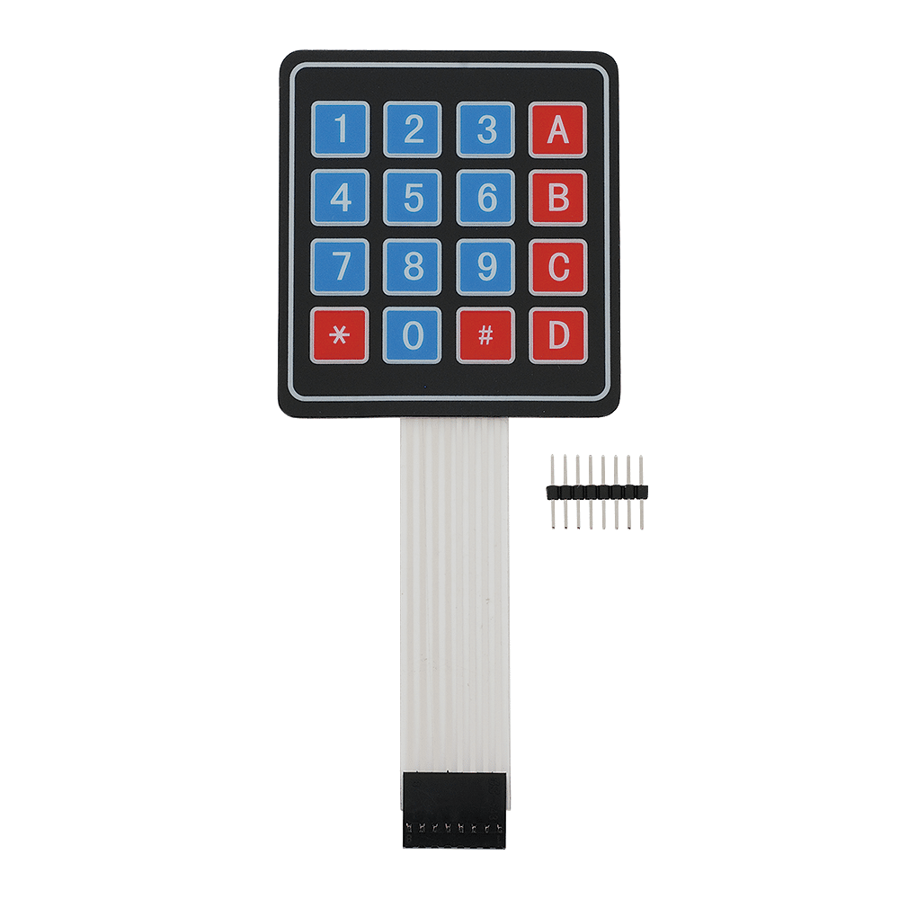

# p2ndaw.githuob.io
  
                                  Intro:

My name is Pape Ndaw and I'm going into my sophomore year at Swampscott High School in Massachusetts. This summer I built a security system utilizing an ultrasonic sensor, a keypad, and a RFID card reader. In this reposotory I'll be showing you exactly how it works.

                              How It Works:

The ultrasonic sensor detects how close something is to the system. Once something is close the light will turn off signaling that it is detecting something. From there you will enter a single digit code to continue. If the code is correct you scan your card on the RFID reader and in the card is right you will have access.
   
                             Picture:


                            Ultrasonic Sensor:

The first thing I did was connect my ultrasonic sensor to my motherboard, the Elegoo Mega 2960 R3. I connected the VCC pin to 5 volt before connect my echo, trig, and ground. The echo and trig go into digital pins so in order so things to eaiser and better to see I connected the pin sinto my breadboard using male to male wires before connecting the trig and echo pins.


                            RFID and Keypad       

Next, I connected my RFID(radio frequency identification system) to scan my card. I once again connected it through my breadboard jsut to allow everything to be smoother. After that I repeated the same process with my keypad


                                   RGB
        
When I finished, I connected my RGB which is a led. I used a 220 resistor to resist the flow of the curennt to make sure the light doesn't overflow with power. I connected something called a cathode to the ground so the light can turn on.        


                                   Code:

 Once all your connections are done you need to code it in Arduino, I will put the code below.
 ```C++
#include <SPI.h>
/* Include the RFID library */
#include <RFID.h>
#include "SR04.h"
#include <Keypad.h>

#define TRIG_PIN 10
#define ECHO_PIN 11
#define SDA_DIO 9
#define RESET_DIO 8
#define BLUE 4
#define GREEN 3
#define RED 2


//KeyPad begin setup
const byte ROWS = 4;  //four rows
const byte COLS = 4;  //four columns
//define the cymbols on the buttons of the keypads
char hexaKeys[ROWS][COLS] = {
  { '1', '2', '3', 'A' },
  { '4', '5', '6', 'B' },
  { '7', '8', '9', 'C' },
  { '*', '0', '#', 'D' }
};
byte rowPins[ROWS] = { 23, 27, 31, 35 };  //connect to the row pinouts of the keypad
byte colPins[COLS] = { 39, 43, 47, 24 };  //connect to the column pinouts of the keypad
Keypad customKeypad = Keypad(makeKeymap(hexaKeys), rowPins, colPins, ROWS, COLS);

//KeyPad end setup

RFID RC522(SDA_DIO, RESET_DIO);
SR04 sr04 = SR04(ECHO_PIN, TRIG_PIN);
long distance;
char customKey = customKeypad.getKey();
char enteredKey = ' ';
/* Define the DIO used for the SDA (SS) and RST (reset) pins. */
/*
PINOUT:
RC522 MODULE    Uno/Nano     MEGA
SDA             D10          D11
SCK             D13          D52
MOSI            D11          D51
MISO            D12          D50
IRQ             N/A          N/A
GND             GND          GND
RST             D9           D8
3.3V            3.3V         3.3V
*/

/* Create an instance of the RFID library */

void setup() {
  Serial.begin(9600);
  /* Enable the SPI interface */
  SPI.begin();
  /* Initialise the RFID reader */
  RC522.init();

  pinMode(RED, OUTPUT);
  pinMode(GREEN, OUTPUT);
  pinMode(BLUE, OUTPUT);
  digitalWrite(RED, LOW);
  digitalWrite(GREEN, LOW);
  digitalWrite(BLUE, LOW);
}

void loop() {
  distance = sr04.Distance();
  // We start with if distance is < 100
  if (distance < 100) {
    digitalWrite(BLUE, LOW);
    // Serial.println("pls scan now");
    if (RC522.isCard()) {
      /* If so then get its serial number */
      String cardNumberScanned = "";
      RC522.readCardSerial();
      Serial.println("Card detected:");
      for (int i = 0; i < 5; i++) {
        // Serial.print(RC522.serNum[i], DEC);
        cardNumberScanned.concat(RC522.serNum[i]);
      }
      Serial.println();
      Serial.print("card Number: ");
      Serial.println(cardNumberScanned);
      if (cardNumberScanned.compareTo("13646395236") == 0) {
        if (enteredKey == '1') {
          digitalWrite(RED, LOW);
          digitalWrite(GREEN, LOW);
          digitalWrite(BLUE, LOW);
          delay(300);
          digitalWrite(RED, LOW);
          digitalWrite(GREEN, HIGH);
        } else {
          Serial.print("incorrect code: ");
          Serial.println(enteredKey);
          digitalWrite(RED, LOW);
          digitalWrite(GREEN, LOW);
          digitalWrite(BLUE, LOW);
          delay(300);
          digitalWrite(RED, HIGH);
          digitalWrite(GREEN, LOW);
        }

      } else {
        digitalWrite(RED, LOW);
        digitalWrite(GREEN, LOW);
        digitalWrite(BLUE, LOW);
        delay(300);
        digitalWrite(RED, HIGH);
        digitalWrite(GREEN, LOW);
        Serial.println("no card incorrect");
      }
      Serial.println();
      Serial.println();
    }
  } else {
    digitalWrite(BLUE, HIGH);
  }
  /* Has distance card been detected? */
  customKey = customKeypad.getKey();
  if (customKey && enteredKey != customKey) {
    Serial.println(customKey);
    enteredKey = customKey;
  }
  if (customKey == 'D') {
    Serial.print(distance);
    Serial.println("cm");
  }
}
```
                                  

                              Tools:

https://www.amazon.com/ELEGOO-Project-Tutorial-Controller-Projects/dp/B01D8KOZF4
Above it the link to make the project.


   
